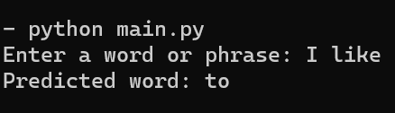

# Simple Text Prediction Algorithm

This is a simple trigram AI text prediction algorithm that I made a few years ago.



## Table of Contents

- [Installation](#installation)
- [Usage](#usage)
- [Creating a Dataset](#creating-a-dataset)
- [Credits](#credits)
- [Licence](#licence)

## Installation 

First, clone the Github repository with this command:
```
git clone https://github.com/DarkTwentyFive/Simple-Text-Prediction.git
```
There are **no dependencies** in this project, so you do not need to install anything else.

## Usage

Then, enter the code directory with:
```
cd Simple-Text-Prediction
```

Finally, run the code with:
```
python main.py
```

You will then receive an input to enter a word or phrase, enter it in and you will receive the predicted next word.

## Creating a Dataset

You can add to the existing dataset or create a new one by modifying or creating a new `dataset.json`.

This is a snippet of how `dataset.json` looks:

```json
{
   "data":[
      "The quick brown fox jumps over the lazy dog.",
      "Hello, how are you today?",
      "What is the weather like?",
      "How are you doing?",
      "I like to code.",
      "Can you recommend a good book?",
      "Where is the nearest coffee shop?",
      "What time is the movie tonight?"
   ]
}
```

## Credits

Developed by Ruben Roy.

## License

GrooveFM is open-source and is under the MIT License. See the [LICENSE](LICENSE) for more information.
